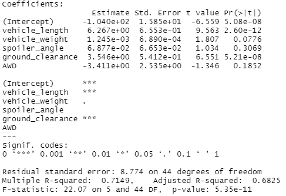
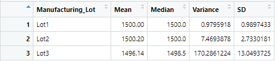
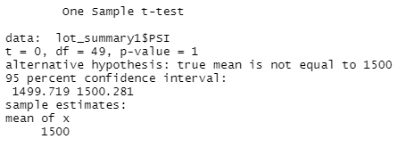
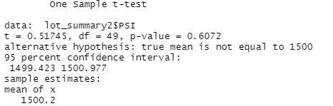
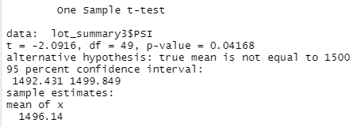

# MechaCar Statistical Analysis

## Overview
* This analysis was performed to investigate further into MechaCar production data to supply upper management with insights that may help the manufacturing team.

## Linear Regression to Predict MPG
* The spoiler weight, vehicle angle, and AWD all contributed to non-random variances. The variables that are most significant are ground clearance and vehicle length.

* The slope of the line is not zero as shown by the p-value of 5.35⁻¹¹

* This model has an r² value of 0.71, 71% of the mpg variations are attributed to vehicle length, spoiler angle, vehicle weight, ground clearance, and drivetrain. This linear model is fairly efficient at predicting the mpg of MechaCar prototypes.

    

## Summary Statistics on Suspension Coils
* The design specifications for the MechaCar suspension coils dictate that the variance of the suspension coils must not exceed 100 pounds per square inch. The variance of the suspension coils overall is 62.3 psi. Lot 1 has a variance of 0.98 psi, Lot 2 has a variance of 7.47 psi, and Lot 3 has a variance of 170.29 psi. Lot 1 and Lot 2 are within their respected limits, however, Lot 3 is out of the design specifications

    

    

## T-Tests on Suspension Coils
* The p-value of Lot 1 is 1.0 so we cannot reject the null hypothesis.

    

* The p-value of Lot 2 is 0.61 so we cannot reject the null hypothesis.

    

* The p-value of Lot 3 is 0.042 so we can reject the null hypothesis and conclude that the psi in Lot 3 is statistically different.

    

## Study Design: MechaCar vs. Competition
* Write a short description of a statistical study that can quantify how the MechaCar performs against the competition. In your study design, think critically about what metrics would be of interest to a consumer: for a few examples, cost, city or highway fuel efficiency, horse power, maintenance cost, or safety rating.

* Metrics tested:
    - Safety Feature Rating: Independent Variable
    - Current Selling Price: Dependent Variable

* Null hypothesis and alternative hypothesis:
    - Hₐ: MechaCar is not priced correctly based on its safety rating.
    - H₀: MechaCar is priced correctly based on its safety rating.

* A multiple linear regression would be used to determine if the safety rating is correlated to the current selling price of the car. 

* Data needed to perform test:
    - Current Selling Prices
    - Safety Ratings

## Questions

* You can contact me via email or GitHub!

    * Email: emilyporter920@gmail.com
    * GitHub Profile: Emily Porter || github.com/emilyporter920 